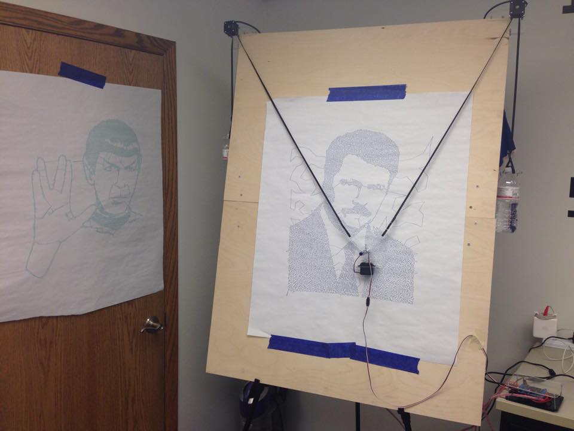
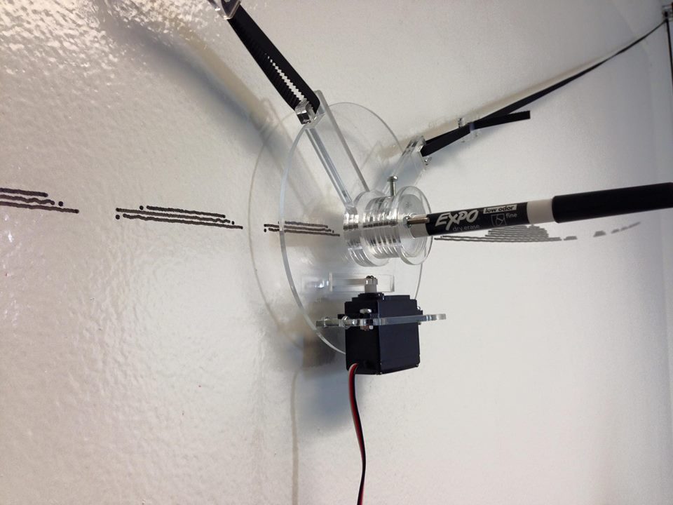
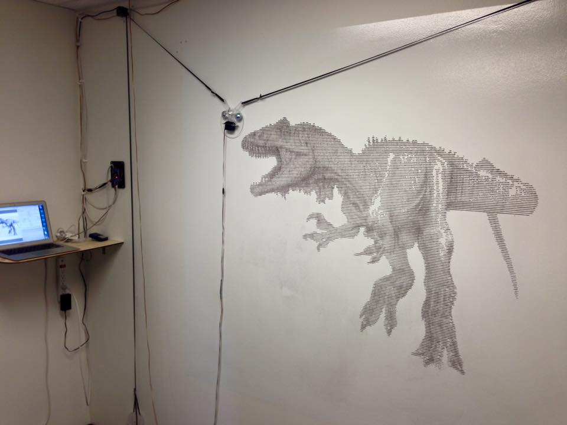

# Mega Sketch

Polargraph style drawbots are a simple and inexpensive way to make a large format drawing robot.

Using the open source Makelangelo Software and off the shelf electronics, we were able to put together a set of laser cut parts that improved upon existing designing.  Mainly we focused on creating a sturdy clear acrylic pen/ servo holder (Godola) that could easily accmodate different sized pens and markers.  For counter weights we used two standard plastic water bottles halfway filled up with water. A good video of one of our builds can be found below.

https://www.youtube.com/watch?v=kmjO7Mm65oI

Typically we used a 3 foot by 4 foot piece of plywood to mount the system on.  This allowed for the use or large sheets of office paper, especially the self sticking kind.  You can see an example of this on the top picture and video.  A variety of M3 screws of various lengths were used for the Gondola and the Stepper holders.  Motors were held onto the plywood via a pressure/ clamp connection.

Electronics Needed: 2 x NIMA 17 Stepper Motor, Arduino Uno, Adafruit Motor Shield 1 (clones can be found on Amazon), Futuba Standard Servo (S3003 for example), Servo Extension Cable, 2 x GT2-6 Pully, GT2-6 Belt, 2 x water bottle, 12V power supply.

## Ultra Sketch

We wanted to see if we could make an even larger version of the Mega Sketch.  We covered a wall with off the shelf dry erase paint (Home Depot) and bolted parts to our wall.  We modified the stepper holders to more easily mount on our wall with drywall screws, added large metal washers to our Gondola in order to give it more weight, as well as just laser cut some acrylic counter weights.  The entire project ended up being around 6 x 6 worth of useable drawing area.  We posted several videos on youtube showing off this project.

https://www.youtube.com/watch?v=VsN8Ynlj7c4

This would make a nice project for anyone looking to create a large installation for a school or library.  We recommend getting better dry erase paint then what we used, as ours seemed gather grime over time.  
